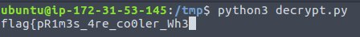
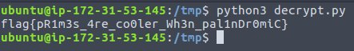

# Homecooked
Points: 100
## Category
Cryptography
## Problem Statement
```
I cannot get this to decrypt!
Download the file below.
```
Attachment : "decrypt.py"
## Solution
Run `decrypt.py`.
I started printing flag but suddently stops.\
\
Open decrypt.py\
A close look at source code reveals a(num) returns if num is prime in O(num).\
```py
def a(num):
    if (num > 1):
        for i in range(2,num):
            if (num % i) == 0:
                return False
                break
        return True
    else:
        return False
```
But one can check if a number num is prime in O(sqrt(nums))\
```
def a(num):
    if num==2:
        return True
    if num==1 or num%2==0:
        return False
    i=3
    while i*i<=num:
        if num%i==0:
            return False
        i+=2
    return True
```

## Flag
```
flag{pR1m3s_4re_co0ler_Wh3n_pal1nDr0miC}
```
