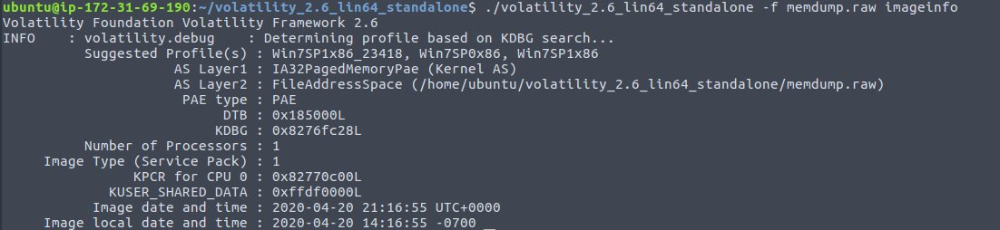
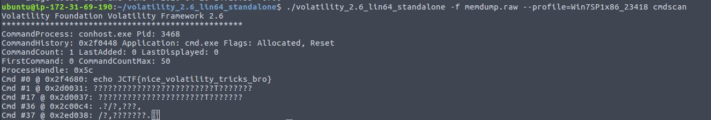

# Volatile
Points: 125
## Category
Forensics
## Problem Statement
```
What was the flag again? I don't remember...
You don't need the password.
Download the file below.
Note, this flag is not in the usual format.
http://johnhammond.org/static/misc/memdump.tar.gz
OR
Large File Hosted with Google Drive
```
## Solution
File was too large. ~500 MB in compressed version and ~2GB in unzipped. Laptop I was using had 2GB RAM.\
I couldnt even run a `grep` on file.\
I had Amazon AWS educate credits. I launched aws t2.large instance with 8 GB ram.\

Then I just followed [CTF 101 Memory Forensics](https://ctf101.org/forensics/what-is-memory-forensics/)
```
./volatility_2.6_lin64_standalone -f memdump.raw imageinfo
```

```
./volatility_2.6_lin64_standalone -f memdump.raw --profile=Win7SPIx86_23418 cmdscan
```


## Flag
```
JCTF{nice_volatility_tricks_bro}
```