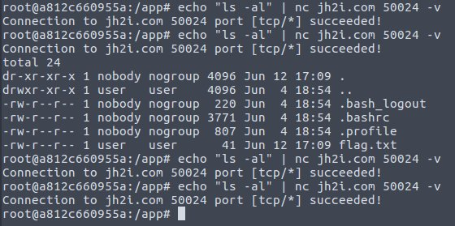
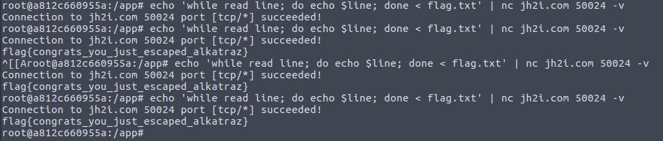

# Alkatraz
Points: 100
## Category
Miscellaneous
## Problem Statement
```
We are so restricted here in Alkatraz. Can you help us break out?
Connect here:
nc jh2i.com 50024
```
## Solution
Restricted bash.\
With probability 0.25 it used to respond `echo "ls -al" | nc jh2i.com 50024 -v` with file names in current directory.\


`PATH environment variable was set to /Alkatraz`\
As a consequence of this `/bin/*` commands used to return command not found.\
Other read file/redirect IO commands were restricted.\
After trying a lot of ways to read content of files (including but not limited to cat,more,less,head,tail,>>) at last read along with for loop worked.
```
echo 'while read line; do echo $line; done < flag.txt' | nc jh2i.com 50024 -v
```

## Flag
```
flag{congrats_you_just_escaped_alkatraz}
```
