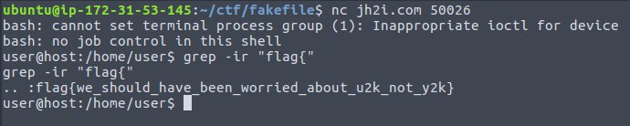

# Fake File
Points: 100
## Category
Miscellaneous
## Problem Statement
```
Wait... where is the flag?
Connect here:
nc jh2i.com 50026
```
## Solution
```
nc jh2i.com 50026
grep -ir "flag{"
```

## Flag
```
flag{we_should_have_been_worried_about_u2k_not_y2k}
```