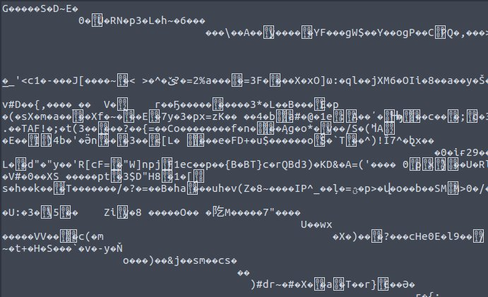

1.

# Vortex
Points: 75
## Category
Miscellaneous
## Problem Statement
```
Will you find the flag, or get lost in the vortex?
Connect here:
nc jh2i.com 50017
```
## Solution
On launching `nc jh2i.com 50017`\

```
nc jh2i.com 50017 > in1.txt
vim in1.txt
:?flag{
```
## Flag
```
flag{more_text_in_the_vortex}
```