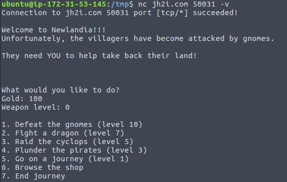
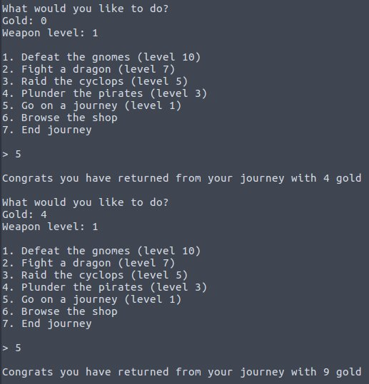
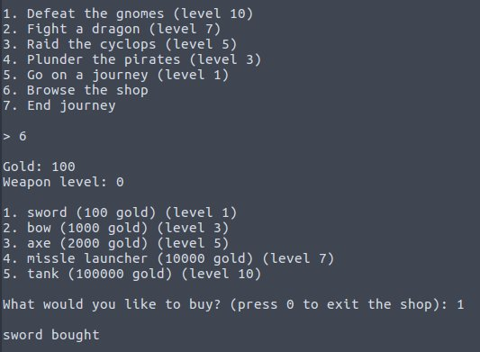
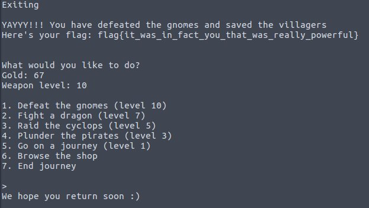

# Really Powerful Gnomes
Points: 150
## Category
Scripting
## Problem Statement
```
Only YOU can save the village!
Connect with:
nc jh2i.com 50031
```

## Solution
#### One very useful tip at the end.
Fire up `nc jh2i.com 50031`.\
Play game for few minutes and you will realise you need something for its automation.\
I found [this](https://gist.github.com/leonjza/f35a7252babdf77c8421) awesome netcat like module written in python.\
Rest was writing script to automate this task.

[Full script](script.py)

We need one function for playing game until we can level up.\

```py
cur_level=0
cost=[100,1000,2000,10000,100000]
while True:
    nc.buff = b''
    string = nc.read_until(b"7. End journey").decode("utf-8")
    print("[ Read log: "+string+"]")

    if cur_level==len(cost):
        print("Exiting")
        nc.write(str.encode("7\n"))
        nc.read_until(b'keep__calm',True)
    elif current_balance(string)>=cost[cur_level]:
        cur_level+=1
        level_up(cur_level)
    nc.write(str.encode(str(6-cur_level)+'\n'))
```


One function for level up.\

```py
def level_up(n):
    print("Moving to next level. Current level "+str(n-1))
    nc.write(str.encode('6\n'))
    nc.buff = b''
    string = nc.read_until(b"tank (100000 gold) (level 10)").decode("utf-8")
    nc.write(str.encode(str(n)+'\n'))
    print("Moved to next level. Current level "+str(n))
```

One for current balance.\
```py
def current_balance(s):
    s = s[s.find('Gold: ')+len('Gold: '):]
    s = s[:s.find('Weapon ')-1]
    print("Current gold "+s)
    return int(s)
```

## Flag
```
flag{it_was_in_fact_you_that_was_really_powerful}
```


## TIP -
Offline this script takes ~15 mins, while running it on amazon aws server takes just 30s.