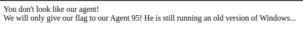
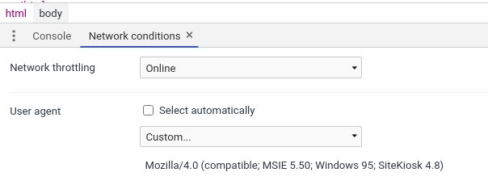
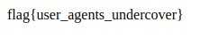

# Agent 95
Points: 50
## Category
Web Exploitation
## Problem Statement
```
They've given you a number, and taken away your name~
Connect here:
http://jh2i.com:50000
```

## Hint
You dont need windows 95.
## Solution
Most websites recognise browser by looking at User Agent with the request.\
A google search [changing user agent on chrome](https://winaero.com/blog/change-user-agent-chrome/) gives a method to change useragent.\
One more google search gives us the useragent `Mozilla/4.0 (compatible; MSIE 5.5; Windows 95)`.

## Flag
```
flag{user_agents_undercover}
```
