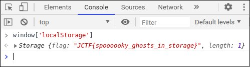

# Localghost
Points: 75
## Category
Web Exploitation
## Problem Statement
```
BooOooOooOOoo! This spooOoOooky client-side cooOoOode sure is scary! What spoOoOoOoky secrets does he have in stooOoOoOore??
Connect here:
http://jh2i.com:50003
Note, this flag is not in the usual format.
```
## Solution
1. First rule of thumb in web exploitation is look at page source instead of page.
2. With close inspection one will find a script `/jquery.jscroll2.js` in the webpage.
3. Script is an obscure javascript. Open it using [Javascript Beautifier](https://beautifier.io/).
4. One line in beautified code is
```javascript
    window['localStorage']['setItem']('flag',atob('SkNURntzcG9vb29va3lfZ2hvc3RzX2luX3N0b3JhZ2V9'));
```
5. Open developer console in browser to echo `window['localStorage']`.\

## Flag
```
JCTF{spoooooky_ghosts_in_storage}
```
