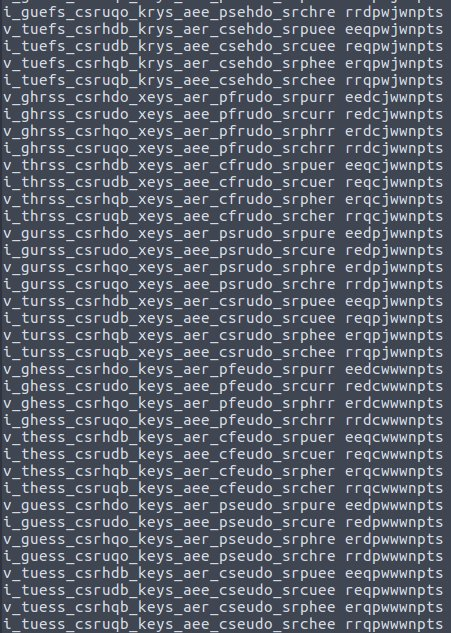

# Pseudo Key
Points: 341
## Category
Crypto
## Problem Statement
Keys are not always as they seem...\
Note: Make sure to wrap the plaintext with flag{} before you submit!\
Attachment : "pseudo-key-output.txt" and "pseudo-key.py"\
## Solution

Looking at pseudo-key.py . I found that I was given cipher encoded using [vigenère cipher](https://en.wikipedia.org/wiki/Vigen%C3%A8re_cipher). Also I was given cipher of key encoded using same key.\

First I decoded given cipher using same key. Then added encoded using cipher key. Then I divided that using 2.\
This gave me key modulo 13 instead of usual 26 for alphabets i.e. I cant distinguish between char `b` and `o`.\

Key was 11 chars long. I generated all 2^11 permutations of key and decoded cipher using it.\
\

Manually inspecting some solns one can guess first few words are `i_guess_*_keys`. This drastically reduces search space. Looking at solns one can say flag is `i_guess_pseudo_keys_are_pseudo_secure`.\
Key turned out to be `redpwwwnctf`.\

Files - [pseudo_key.py](files/pseudo_key.py)
## Flag
```
flag{i_guess_pseudo_keys_are_pseudo_secure}
```
