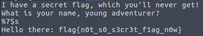

# Secret Flag
Points: 348
## Category
Pwn
## Problem Statement
There's a super secret flag in printf that allows you to LEAK the data at an address??
nc 2020.redpwnc.tf 31826
Attachment : "secret-flag"
## Solution
* We decompiled given binary using [Retargetable Decompiler](https://retdec.com/). Didnt helped much.
* After googling around we found there are a lot of results about `memory leak printf`.
* Then we also looked at decompiled binary to find if its indeed memory leak in printf. Although problem description said this.
* It had `printf(format)` statement. This is indeed memory leak.
* We literally tried all possible google results we got in previous ctf writeups about memory leak.
* Decompiled source code had `read(open("flag.txt", O_RDONLY), malloc(256), 256);` line.
* We found some interesting exploits related to memory leak in printf. But those didnt helped much.
* This meant flag is present on heap and pointer of that address is present on stack.
* Finally [this writeup](https://medium.com/@nikhilh20/format-string-exploit-ccefad8fd66b) of picoCTF 2018 printf memory leak helped us.
* It mentioned using `%s` we can read arbitrary address on stack.
* It also mentioned we can also read off values at Nth offset using `%N$s`.
* We found flag at 7th offset.
* `nc 2020.redpwnc.tf 31826` and then `%7$s`.



## Flag
```
flag{n0t_s0_s3cr3t_f1ag_n0w}
```