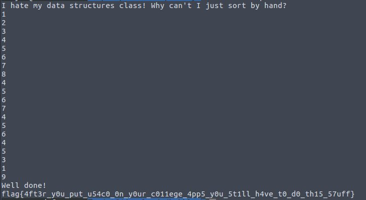

# Bubbly
Points: 395
## Category
rev
## Problem Statement
It never ends\
nc 2020.redpwnc.tf 31039\
Attachment : "bubbly"
## Solution
* We decompiled given binary using [Retargetable Decompiler](https://retdec.com/).
* Looking at it we found program stops asking input if we send numbers >=9.
* It calls one check() function and if it returns true we will get one flag.
* We input numbers between 0-8 it does some operations on one given array of 10 digits.
* We ran binary using `chmod +x bubbly` `gdb ./bubbly`.
* Now we had to decode what changes program makes when we add inputs.
* Program called `check()` fn before asking for input. Add a checkpoint on `check()` fn using `b check`.
* We can also print array with variable name `nums` using `p nums`.
* Then we just supplied inputs 0-8 and looked at results.
* Only to figure out input `0<=i<9` swaps `num[i],nums[i+1]`.
* Starting binary was the msg "I hate my data structures class! Why can't I just sort by hand?"
* We just manually sorted it using hand to get the flag.



## Flag
```
flag{4ft3r_y0u_put_u54c0_0n_y0ur_c011ege_4pp5_y0u_5t1ll_h4ve_t0_d0_th15_57uff}
```