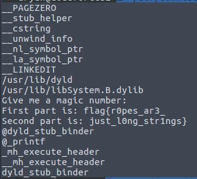

# Ropes
Points: 128
## Category
rev
## Problem Statement
It's not just a string, it's a rope!\
Attachment : "ropes"
## Solution
As the name suggests I just did `strings -a -n 8 ropes`.\

## Flag
```
flag{r0pes_ar3_just_l0ng_str1ngs}
```